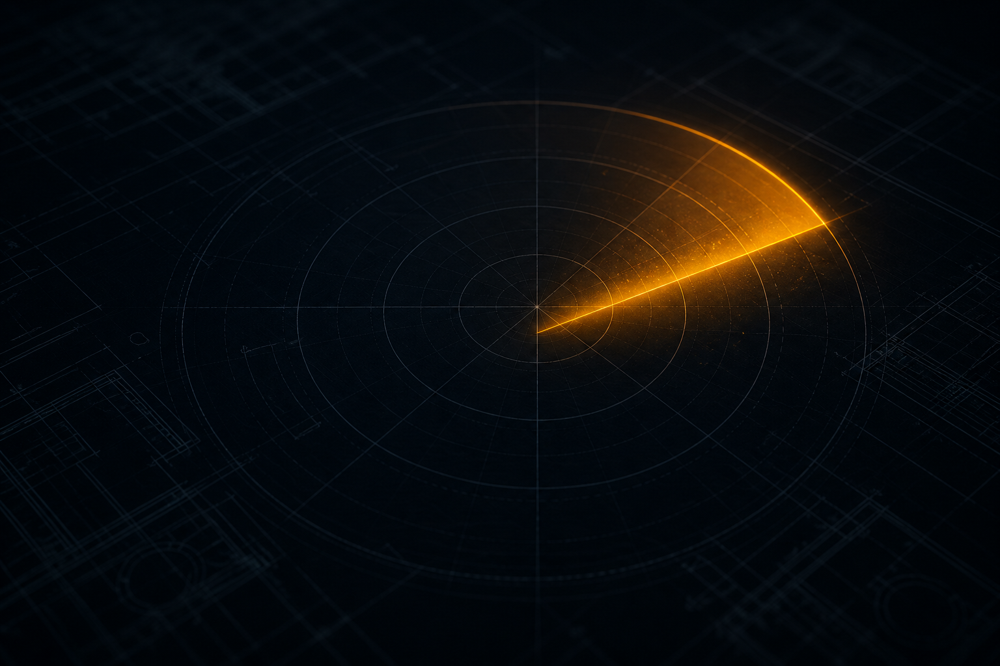
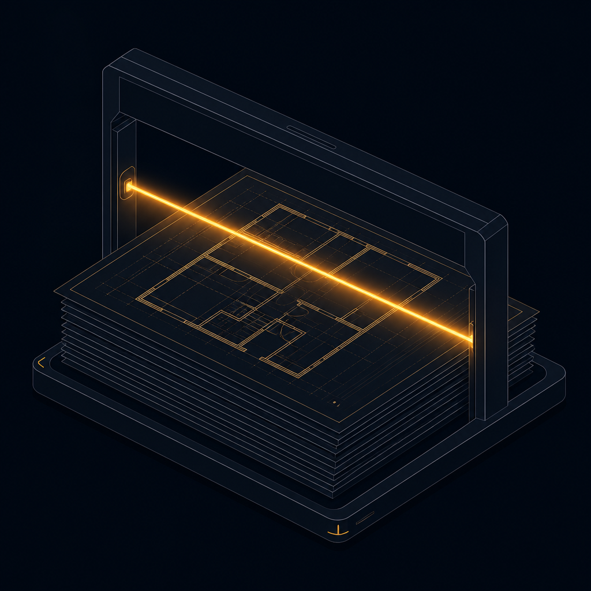
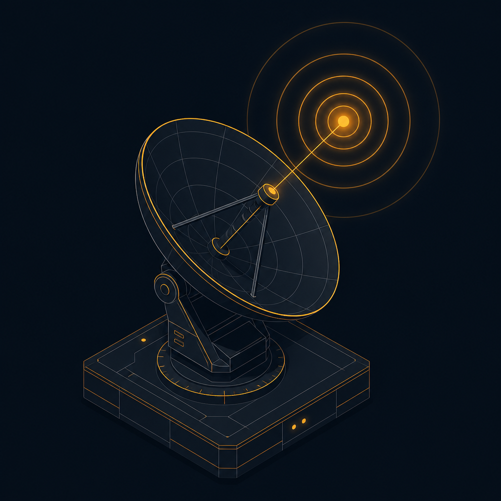
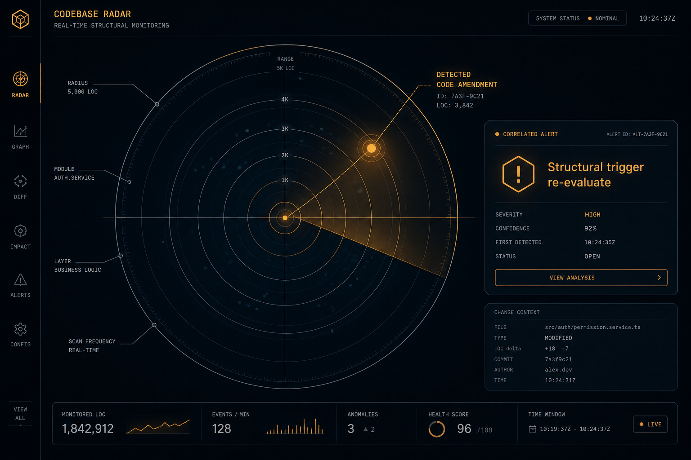
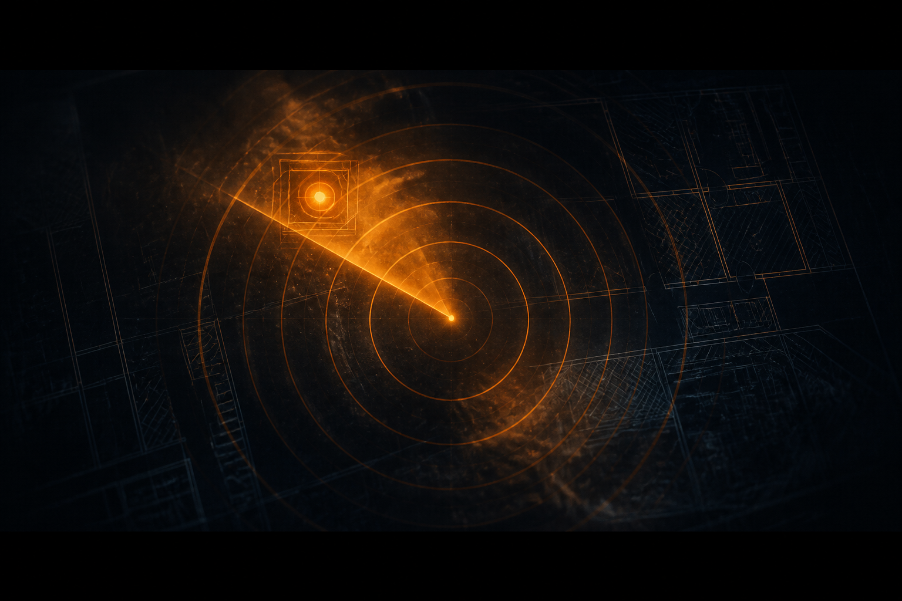
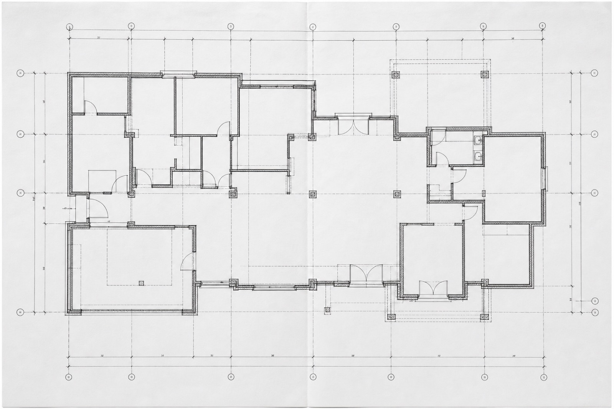
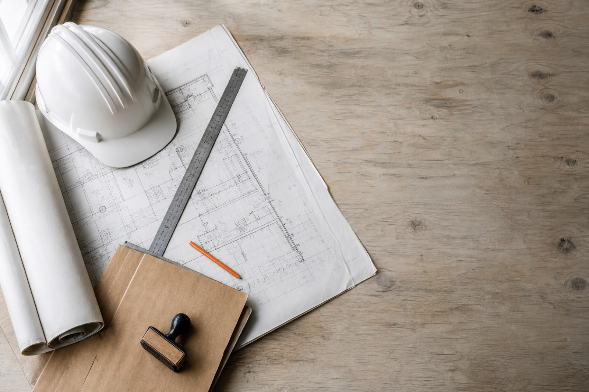
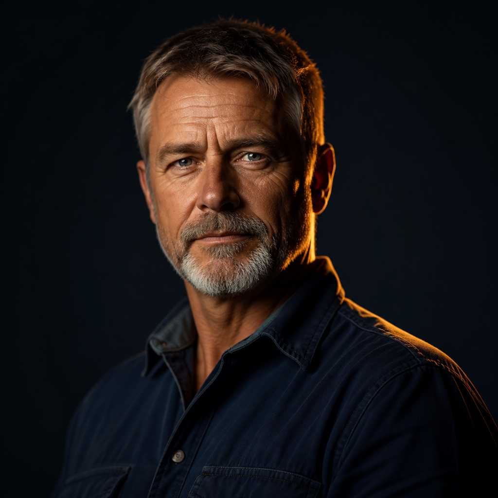
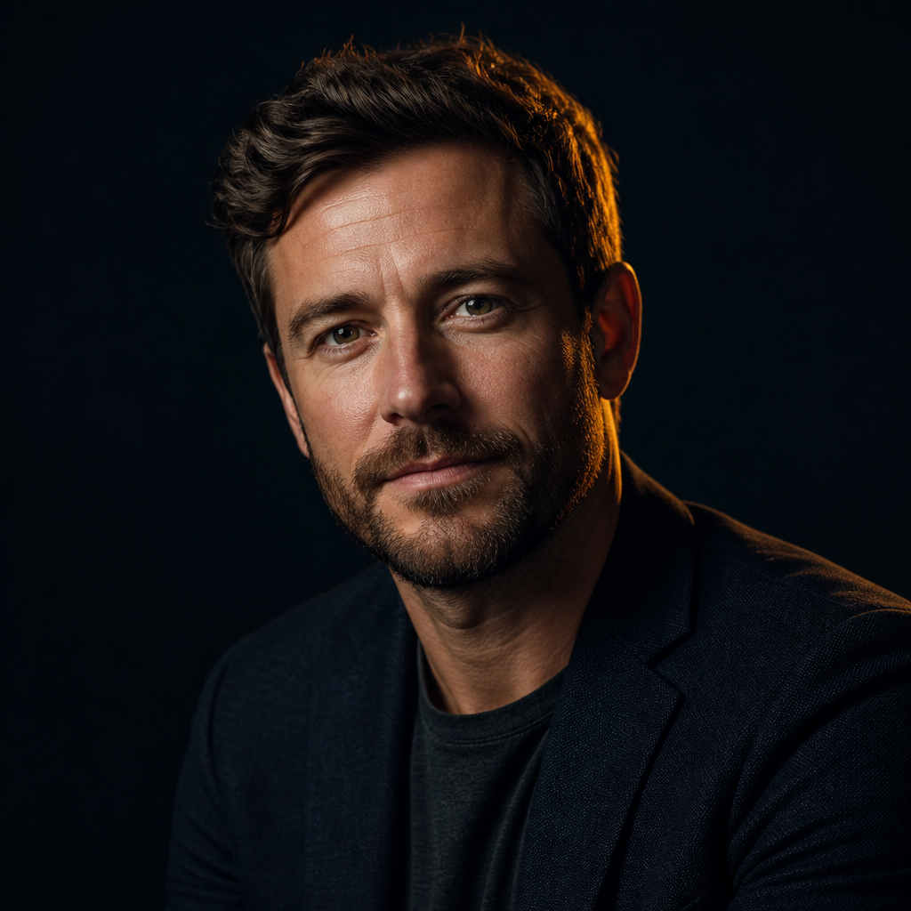
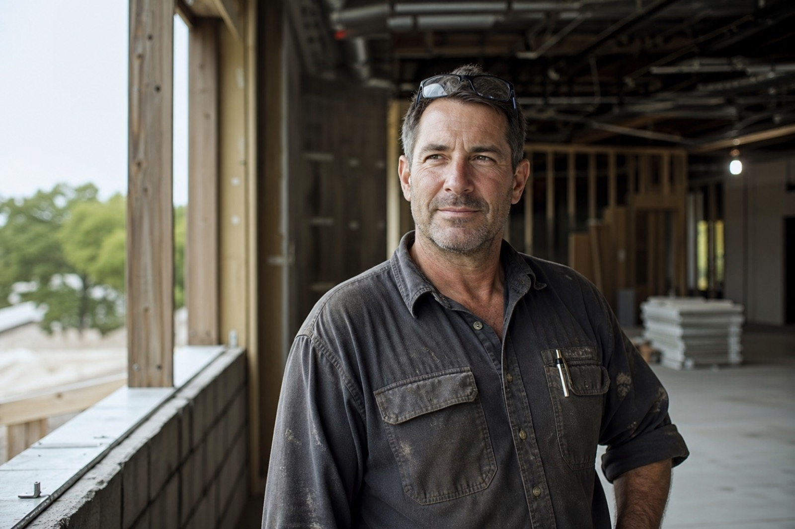

# BuildScope Brand Assets

Share this file with anyone building product, marketing, decks, or sales materials.

**Theme:** Minimal Industrial  
**Line:** The quiet tool professionals trust.  
**Object metaphor:** A beautifully machined aluminum measuring tool — not flashy, not trendy, just precisely made.

For deeper art direction, see [`BRAND_THEME.md`](./BRAND_THEME.md).  
For image generation prompts, see [`ASSET_GENERATION_PROMPTS.md`](./ASSET_GENERATION_PROMPTS.md).

---

## 1. Quick copy kit

| Asset | Value |
|---|---|
| Product name | BuildScope |
| Tagline | The quiet tool professionals trust. |
| Accent | Safety Lime `#C7F000` — max 3–5% of any composition |
| Page background | Paper `#F8F8F6` |
| Primary text / mark | Carbon Black `#111111` |
| Display font | Geist |
| Body font | Inter |
| Mono font | Geist Mono |

**Never use:** startup purple, orange, blue accents, neon glow, chrome, glossy plastic, rounded playful shapes, construction-company branding, rustic workshop aesthetics.

---

## 2. Color palette

The brand lives in grayscale. One accent guides attention.

### Primary (grayscale)

| Name | Hex | RGB | Role |
|---|---|---|---|
| Carbon Black | `#111111` | `17, 17, 17` | Primary text, structure, heavy surfaces |
| Graphite | `#242424` | `36, 36, 36` | Panels, deep surfaces |
| Steel | `#5E5E5E` | `94, 94, 94` | Secondary text, labels |
| Concrete | `#A7A7A7` | `167, 167, 167` | Tertiary / disabled |
| Fog | `#EAEAEA` | `234, 234, 234` | Soft surfaces, dividers |
| Paper | `#F8F8F6` | `248, 248, 246` | Page background, paper stock |
| White | `#FFFFFF` | `255, 255, 255` | Pure white surfaces |

### Hairlines

| Name | Hex | Role |
|---|---|---|
| Hairline | `#E4E4E1` | Default borders / rules |
| Hairline Strong | `#D2D2CE` | Slightly stronger rules |

### Accent (Safety Lime)

| Name | Hex | Role |
|---|---|---|
| Lime | `#C7F000` | Selection, important action, current project, status |
| Lime Deep | `#A8CC00` | Edges / hover on lime surfaces |
| Lime Ink | `#566B00` | Lime as legible text on paper |
| Lime Wash | `#F4FBD6` | Soft lime tint for light fills |

**Lime rules**

- Budget: **3–5% max** of any composition
- Use for: selection, one important action, current state, status
- Never use for: full backgrounds, entire button fills, broad gradients, decorative glow

### Functional (not brand)

| Name | Hex | Role |
|---|---|---|
| Alert | `#B3261E` | Errors only — never marketing |
| Alert Wash | `#FBECEB` | Error surface tint |

### CSS tokens (source of truth)

`platform/src/app/globals.css` — `--color-carbon`, `--color-lime`, etc.

---

## 3. Typography

| Role | Font | Fallback | Use |
|---|---|---|---|
| Display | Geist | Helvetica Neue, Arial | Large headlines, wordmark |
| Body | Inter | system-ui | UI and editorial body |
| Mono | Geist Mono | ui-monospace | Permit numbers, code refs, dimensions, revision IDs, drawing labels |

**Loaded in app:** `platform/src/app/layout.tsx` (Next.js Google fonts)

**Feel:** Huge type. Massive whitespace. Tight tracking on display. No decorative fonts.

---

## 4. Logo & wordmark

### Concept

A measured field with a scope crosshair at its center.

- Corner brackets = plan boundary  
- Crosshair = extracted element  
- Drawn on a 24 grid at 1px stroke so it stays honest at every size  

### React components (canonical)

`platform/src/components/brand/Logo.tsx`

- `LogoMark` — symbol only  
- `Wordmark` — mark + “BuildScope”  

### SVG mark (copy/paste)

```svg
<svg width="24" height="24" viewBox="0 0 24 24" fill="none"
     stroke="#111111" stroke-width="1" stroke-linecap="butt"
     stroke-linejoin="miter" xmlns="http://www.w3.org/2000/svg">
  <!-- Corner brackets -->
  <path d="M2.5 7.5v-5h5M16.5 2.5h5v5M21.5 16.5v5h-5M7.5 21.5h-5v-5"/>
  <!-- Crosshair -->
  <path d="M12 6.5v11M6.5 12h11"/>
  <!-- Center scope -->
  <rect x="9.5" y="9.5" width="5" height="5"/>
</svg>
```

### Logo usage

| Do | Don’t |
|---|---|
| Carbon on Paper (default) | Stretch or distort |
| Keep thin strokes / geometric precision | Add drop shadows or glow |
| Optional tiny lime alignment point (&lt;3%) | Fill the mark with lime |
| Clear space ≈ mark height on all sides | Place on busy photo without contrast |

### Raster glyph (exploratory)

Photographic / generated glyph study. Prefer the SVG mark for product UI.


`web/public/images/logo-glyph.jpg`

---

## 5. Photography & marketing images

Canonical set: **`platform/public/images/`**  
(Subset mirrored in `web/public/images/` and `site/img/`.)

Open this file in a Markdown preview (GitHub, VS Code, Cursor) to see every asset.

### Heroes

**`hero-blueprint.jpg`** — Hero / plan atmosphere



**`hero-site.jpg`** — Site context


### How it works

**`how-upload.jpg`** — Upload



**`how-radar.jpg`** — Radar / scan



**`how-reason.jpg`** — Reasoning


### Features & CTA

**`radar-feature.jpg`** — Radar / scope detection



**`cta-radar-band.jpg`** — Final CTA band background



### Still life & documentary

**`hands-plans.jpg`** — Hands on drawings


**`plan-sheet.jpg`** — Plan sheet still



**`permit-packet.jpg`** — Permit packet still life



### Personas

**`persona-paul.jpg`** — Paul (GC owner)



**`persona-maria.jpg`** — Maria (compliance)


**`persona-ray.jpg`** — Ray



**`persona-gc.jpg`** — GC



### Photography direction

Show: raw concrete, steel, material samples, builders reviewing drawings, hands marking plans, survey gear, architectural detail, morning light, dust, quiet moments.

Avoid: staged construction stock, handshakes, hardhat hero poses, neon overlays, chrome UI, cyberpunk AI imagery.

---

## 6. Graphic language

Recurring motifs only — everything else is noise:

- Hairline rules  
- Registration marks / corner brackets  
- Dimension arrows & measurement ticks  
- Crosshairs  
- Tiny coordinates, serial numbers, revision IDs  
- Barcode labels / material tags  
- Specification tables  

**Code:** `platform/src/components/artifacts/marks.tsx`, `labels.tsx`

---

## 7. Motion

Mechanical and precise. CNC, not personality.

| Token | Value |
|---|---|
| Ease machine | `cubic-bezier(0.2, 0, 0, 1)` |
| Ease snap | `cubic-bezier(0.85, 0, 0.15, 1)` |
| Durations | 100 / 160 / 240 / 400 ms |

No bounce. No elastic easing. Everything snaps into place.

---

## 8. Geometry & UI feel

- Radius: **0** everywhere (no rounded corners)  
- Almost no shadows  
- Cards disappear into one carved surface  
- Large spacing, minimal borders  
- Matte materials only — brushed aluminum, powder-coated steel, concrete, paper  

---

## 9. Where things live in the repo

| What | Path |
|---|---|
| This kit | `BRAND_ASSETS.md` |
| Brand theme (philosophy) | `BRAND_THEME.md` |
| Image prompts | `ASSET_GENERATION_PROMPTS.md` |
| Design tokens | `platform/src/app/globals.css` |
| Logo components | `platform/src/components/brand/Logo.tsx` |
| Design system review page | `platform/src/app/design` |
| Marketing images | `platform/public/images/` |

---

## 10. Voice (one line)

Quiet. Precise. Professional. Speak like a well-made tool — short sentences, no hype, no startup jargon.
