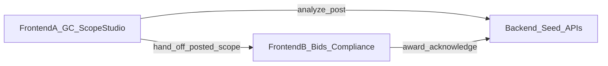

# Hackathon Scope Split (≈1 hour, 2 FE + 1 BE)

## Reality check
Full PRD MVP is impossible. Judges need a **clickable story** that proves the three moats: plans → structured scopes → marketplace → compliance. Everything else is mocked or seeded.

**Demo script (what you submit):**
1. "Log in" as GC → open sample project (or fake upload)
2. See AI Scope Packages + permit roadmap (mocked analysis)
3. Post one scope → Bid Leveling with 3 seeded bids
4. Award → Compliance Ledger shows trade permits assigned to that sub
5. Flip to Sub view → acknowledge a permit

## Stack (locked for speed)
- **Next.js (App Router) + TypeScript + Tailwind** in one repo
- Backend = **Next.js Route Handlers** + in-memory / JSON seed data (no Neo4j, no Auth0, no S3)
- Shared types in `lib/types.ts`
- Seed data in `lib/seed.ts`

## Explicitly out of scope (do not touch)
- Real CV/OCR/symbol detection, DWG/RVT
- License/insurance APIs, e-sign, Stripe/fees
- Code Change Radar, messaging, Auth0
- Multi-jurisdiction graph, true matching algorithm
- Mobile apps, Procore integrations

---

## Role split

### Backend (1 person) — APIs + seed + mock "AI"
**Owns:** data shape, fake analysis, marketplace/compliance endpoints

| Endpoint | Behavior |
|---|---|
| `GET /api/projects` | Return seeded projects |
| `GET /api/projects/[id]` | Project + scopes + permits |
| `POST /api/projects/[id]/analyze` | Wait ~1.5s, return hard-coded Scope Packages + permit list for sample plans |
| `POST /api/scopes/[id]/post` | Mark scope Posted; attach 3 seeded bids |
| `POST /api/scopes/[id]/award` | Create contract; activate compliance ledger rows for that sub |
| `POST /api/permits/[id]/acknowledge` | Sub marks Obtained / In Progress |
| `GET /api/me?role=gc\|sub` | Fake session (query param role switch) |

**Also deliver:**
- `lib/types.ts` — `Project`, `ScopePackage`, `Bid`, `PermitRequirement`, `SubProfile`
- `lib/seed.ts` — 1 sample project (Phoenix), 4–5 Scope Packages, 5 subs, permit list with fake code URLs
- Keep responses stable so FE can hard-wire the demo path

**Timebox:** 0:00–0:35 APIs + seed; 0:35–0:50 wire award→compliance; 0:50–1:00 fix FE blockers

---

### Frontend A — GC shell + Scope Studio
**Owns:** first half of the demo (impression + aha)

| Screen | Must work |
|---|---|
| Login / role picker | Buttons: "Continue as GC" / "Continue as Sub" (sets role in localStorage or query) |
| Command Center | List seeded projects + fake health score |
| Project / Scope Studio | Split layout: left = static plan image/PDF preview; right = Scope Packages from analyze |
| Actions | "Run AI Analysis" → loading state → packages; "Post to Marketplace" on one package |

**Polish (if time):** amber "AI-suggested" vs green "confirmed" badges; fake bounding-box overlay on a static plan image.

**Timebox:** 0:00–0:15 shell + nav; 0:15–0:40 Scope Studio; 0:40–0:55 post flow; buffer for demo dry-run

---

### Frontend B — Bids + Award + Sub/Compliance
**Owns:** second half of the demo (marketplace + moat vs Claude)

| Screen | Must work |
|---|---|
| Bid Leveling | Table of 3 bids (name, rating, amount, Award) |
| Award confirmation | Calls award API; shows success |
| Compliance Ledger | Permit list with responsible sub + status |
| Sub dashboard | Open awards + "Confirm Permit Obtained" button |

**Timebox:** 0:00–0:20 Bid Leveling (can mock with seed JSON until API ready); 0:20–0:40 Award + Compliance; 0:40–0:55 Sub acknowledge; buffer

---

## Integration contract (agree in first 5 minutes)
```ts
// ScopePackage
{ id, trade, division, summary, quantities[], status: 'draft'|'posted'|'awarded', confidence }

// Bid
{ id, scopeId, subName, rating, amount, notes }

// PermitRequirement
{ id, name, authority, codeUrl, status, responsibleSubId? }
```
- FE A calls `analyze` then `post`
- FE B reads project after post/award; calls `award` and `acknowledge`
- Shared nav: `/`, `/projects/[id]`, `/projects/[id]/bids/[scopeId]`, `/compliance/[projectId]`, `/sub`

## Submission checklist (last 10 minutes)
- One happy-path click-through with no console errors
- README: 3-bullet demo script + `npm run dev`
- Optional: 60–90s screen recording of the loop
- Fake disclaimer footer: "AI-Generated Advisory Draft for Professional Validation"

## Who does what summary



| Person | Lane | Demo ownership |
|---|---|---|
| Backend | Seed + Route Handlers | Data truth for the loop |
| Frontend A | GC Command Center + Scope Studio | "Plans → scopes + permits" |
| Frontend B | Bid Leveling + Award + Sub/Compliance | "Marketplace → compliance" |
